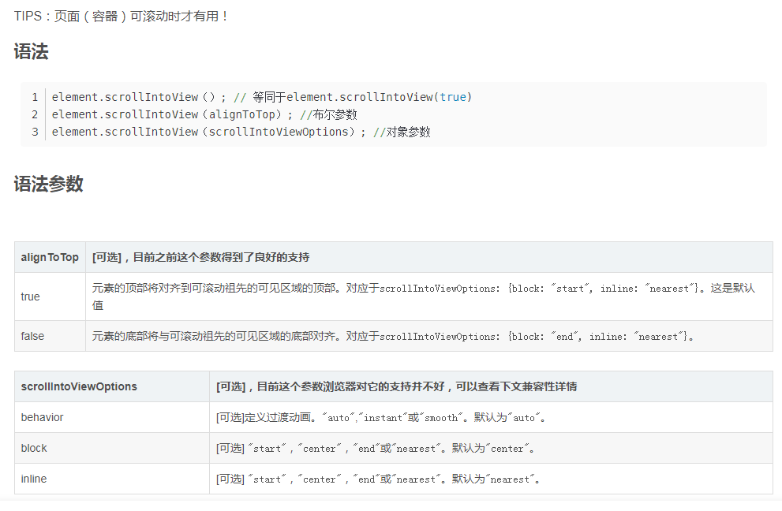

## 网页转MD文档利器

https://www.helloworld.net/html2md

## WebPack 详解
https://juejin.cn/post/6844903599080734728

## 前端知识汇总

https://www.processon.com/view/link/61c53fb31efad45a2b42afd9#map

## 前端框架QianKun微前端

https://github.com/umijs/qiankun

## 前端学习

- https://1loc.dev/
- https://www.5cv.top/

- stroybook https://storybook.js.org/
- tailwindcss https://www.tailwindcss.cn/

## 前端框架组建

https://juejin.cn/post/6951649464637636622

## webpack

http://webpack.wuhaolin.cn/

## Promise 编写sleep方法

```js
const sleep = (ms) => {
  return new Promise(resolve => setTimeout(resolve, ms))
}
```

## scrollIntoView

document.querySelector('.rule-content').scrollIntoView({ behavior: 'smooth', block: 'start' })



https://mp.weixin.qq.com/s/tkX-F5cQHaBP15oCJ2BJZw

## 移动端vh布局软键盘弹起改变高度问题

问题描述
在移动端使用vh布局。当页面中包含input、textarea输入框的时候，或者有调起软键盘的操作时，安卓浏览器下，可视窗口的高度改变，导致页面上的vh重新计算，页面被压扁。ios下的浏览器（safari）没有这个问题。

原因
在ios下，软键盘是叠在可视窗口上面的，也就是不影响可视窗口的大小。但是在安卓，软键盘是在窗口中，即占用窗口的面积。

解决方案
理论：给viewport设置height值，可用window.innerHeight赋值。旋转的时候重新设置

```js
<meta name="viewport" id="viewportMeta" />

<script>
var initViewport = function (height) {
var metaEl = document.querySelector('#viewportMeta');
var content =
'width=device-width, initial-scale=1, maximum-scale=1, minimum-scale=1, user-scalable=no,height=' + height;
metaEl.setAttribute('name', 'viewport');
metaEl.setAttribute('content', content);
};
initViewport(window.innerHeight);
</script>
```

## qrcode

QRCode.js 是一个用于生成二维码的 JavaScript 库。主要是通过获取 DOM 的标签,再通过 HTML5 Canvas 绘制而成,不依赖任何库。
source: https://github.com/davidshimjs/qrcodejs

### 基本用法

```html
<div id="qrcode"></div>
<script type="text/javascript">
new QRCode(document.getElementById("qrcode"), "http://www.runoob.com");  // 设置要生成二维码的链接
</script>
```

或者使用一些可选参数设置：

```js
var qrcode = new QRCode("test", {
    text: "http://www.runoob.com",
    width: 128,
    height: 128,
    colorDark : "#000000",
    colorLight : "#ffffff",
    correctLevel : QRCode.CorrectLevel.H
});
```

## base64

js原生代码

```js
window.btoa(unescape(encodeURIComponent('我是一段需要处理的字符')))
decodeURIComponent(escape(window.atob('5oiR5piv5LiA5q616ZyA6KaB5aSE55CG55qE5a2X56ym')))

// nodejs
var b = new Buffer.from('SmF2YVNjcmlwdA==', 'base64')
let str = b.toString()
console.log(str) // JavaScript


var b = new Buffer('JavaScript');
var s = b.toString('base64'); // SmF2YVNjcmlwdA==

```

## 图片压缩

```js

  /**
   * 压缩图片方法
   * @param {file} file 文件
   * @param {Number} quality 图片质量(取值0-1之间默认0.92)
   */
  compressImg(file, quality) {
    var qualitys = 0.52
    console.log(parseInt((file.size / 1024).toFixed(2)))
    if (parseInt((file.size / 1024).toFixed(2)) < 1024) {
      qualitys = 0.85
    }
    if (5 * 1024 < parseInt((file.size / 1024).toFixed(2))) {
      qualitys = 0.92
    }
    if (quality) {
      qualitys = quality
    }
    if (file[0]) {
      return Promise.all(Array.from(file).map(e => this.compressImg(e,
        qualitys))) // 如果是 file 数组返回 Promise 数组
    } else {
      return new Promise((resolve) => {
        console.log(file)
        if ((file.size / 1024).toFixed(2) < 300) {
          resolve({
            file: file
          })
        } else {
          const reader = new FileReader() // 创建 FileReader
          reader.onload = ({
            target: {
              result: src
            }
          }) => {
            const image = new Image() // 创建 img 元素
            image.onload = async() => {
              const canvas = document.createElement('canvas') // 创建 canvas 元素
              const context = canvas.getContext('2d')
              var targetWidth = image.width
              var targetHeight = image.height
              var originWidth = image.width
              var originHeight = image.height
              if (1 * 1024 <= parseInt((file.size / 1024).toFixed(2)) && parseInt((file.size / 1024).toFixed(2)) <= 10 * 1024) {
                var maxWidth = 1600
                var maxHeight = 1600
                targetWidth = originWidth
                targetHeight = originHeight
                // 图片尺寸超过的限制
                if (originWidth > maxWidth || originHeight > maxHeight) {
                  if (originWidth / originHeight > maxWidth / maxHeight) {
                    // 更宽，按照宽度限定尺寸
                    targetWidth = maxWidth
                    targetHeight = Math.round(maxWidth * (originHeight / originWidth))
                  } else {
                    targetHeight = maxHeight
                    targetWidth = Math.round(maxHeight * (originWidth / originHeight))
                  }
                }
              }
              if (10 * 1024 <= parseInt((file.size / 1024).toFixed(2)) && parseInt((file.size / 1024).toFixed(2)) <= 20 * 1024) {
                maxWidth = 1400
                maxHeight = 1400
                targetWidth = originWidth
                targetHeight = originHeight
                // 图片尺寸超过的限制
                if (originWidth > maxWidth || originHeight > maxHeight) {
                  if (originWidth / originHeight > maxWidth / maxHeight) {
                    // 更宽，按照宽度限定尺寸
                    targetWidth = maxWidth
                    targetHeight = Math.round(maxWidth * (originHeight / originWidth))
                  } else {
                    targetHeight = maxHeight
                    targetWidth = Math.round(maxHeight * (originWidth / originHeight))
                  }
                }
              }
              canvas.width = targetWidth
              canvas.height = targetHeight
              context.clearRect(0, 0, targetWidth, targetHeight)
              context.drawImage(image, 0, 0, targetWidth, targetHeight) // 绘制 canvas
              const canvasURL = canvas.toDataURL('image/jpeg', qualitys)
              const buffer = atob(canvasURL.split(',')[1])
              let length = buffer.length
              const bufferArray = new Uint8Array(new ArrayBuffer(length))
              while (length--) {
                bufferArray[length] = buffer.charCodeAt(length)
              }
              const miniFile = new File([bufferArray], file.name, {
                type: 'image/jpeg'
              })
              console.log({
                file: miniFile,
                origin: file,
                beforeSrc: src,
                afterSrc: canvasURL,
                beforeKB: Number((file.size / 1024).toFixed(2)),
                afterKB: Number((miniFile.size / 1024).toFixed(2)),
                qualitys: qualitys
              })
              resolve({
                file: miniFile,
                origin: file,
                beforeSrc: src,
                afterSrc: canvasURL,
                beforeKB: Number((file.size / 1024).toFixed(2)),
                afterKB: Number((miniFile.size / 1024).toFixed(2))
              })
            }
            image.src = src
          }
          reader.readAsDataURL(file)
        }
      })
    }
  }
```

其他实现
https://juejin.cn/post/6844903568726556686#heading-4

## js时间格式化

```js
const dateFormat = (fmt, date) => {
  let ret;
  const opt = {
      "Y+": date.getFullYear().toString(),        // 年
      "m+": (date.getMonth() + 1).toString(),     // 月
      "d+": date.getDate().toString(),            // 日
      "H+": date.getHours().toString(),           // 时
      "M+": date.getMinutes().toString(),         // 分
      "S+": date.getSeconds().toString()          // 秒
      // 有其他格式化字符需求可以继续添加，必须转化成字符串
  };
  for (let k in opt) {
      ret = new RegExp("(" + k + ")").exec(fmt);
      if (ret) {
          fmt = fmt.replace(ret[1], (ret[1].length == 1) ? (opt[k]) : (opt[k].padStart(ret[1].length, "0")))
      };
  };
  return fmt;
}
```

## shelljs

- https://www.kancloud.cn/outsider/clitool/313191

## JS AOP实现

 AOP (Aspect Oriented Programming) ，意为：面向切面编程，通过预编译方式和运行期动态代理实现程序功能的统一维护的一种技术。AOP是OOP的延续，是函数式编程的一种衍生，利用AOP可以对业务逻辑的各个部分进行隔离，从而使得业务逻辑各部分之间的耦合度降低，提高程序的可重用性，同时提高了开发的效率。

### before（前置通知）

```js
Function.prototype.before = function (beforefun) {
  var _orgin = this;    // 保存原函数引用
  return function () { // 返回包含了原函数和新函数的"代理函数"
    beforefun.apply(this, arguments); // 执行新函数，修正this
    return _orgin.apply(this, arguments); // 执行原函数
  }
};

var originFun = function(val){
  console.log('原型函数: '+val);
}

var newFun = originFun.before(function(){
  // 传入函数调用前处理方法
  console.log('before: ' + new Date().getTime())
})

newFun("测试前置通知");
```

### after（后置通知）

```js
Function.prototype.after = function (afterfun) {
  var _orgin = this;    // 保存原函数引用
  return function () { // 返回包含了原函数和新函数的"代理函数"
    var ret = _orgin.apply(this, arguments); // 执行原函数
    afterfun.apply(this, arguments); // 执行新函数，修正this
    return ret;
  }
};

var originFun = function(val){
  console.log('原型函数: '+val);
}

var newFun = originFun.after(function(){
  // 传入函数调用前处理方法
  console.log('after: ' + new Date().getTime())
})

newFun("测试后置通知");
```

### around（环绕通知）

```js
// 利用前面的before、after方法实现
Function.prototype.around = function(beforeFun, afterFun) {
  var _orgin = this;
  return function() {
    return _orgin.before(beforeFun).after(afterFun).apply(this, arguments);
  }
}
```

Refer：https://juejin.cn/post/6844903838172839943
