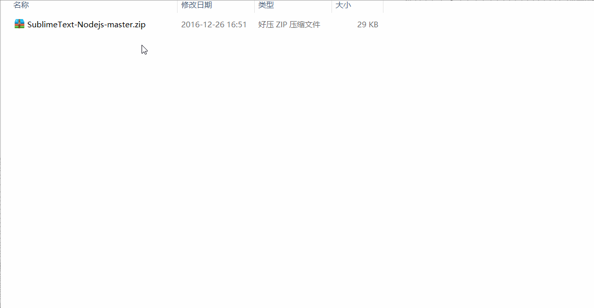
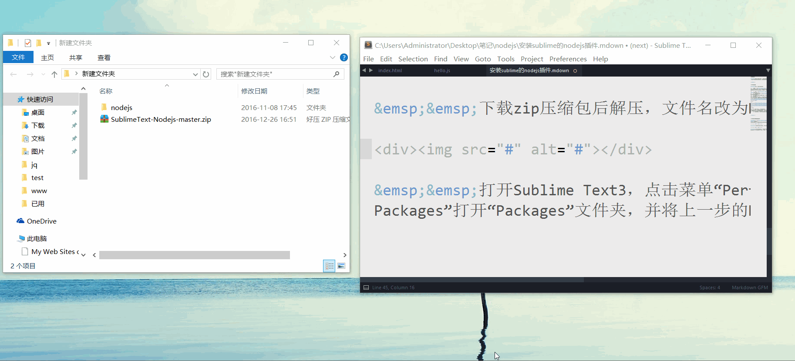
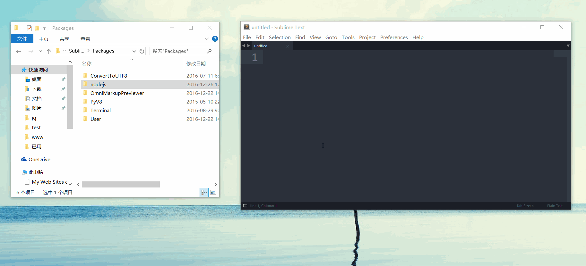
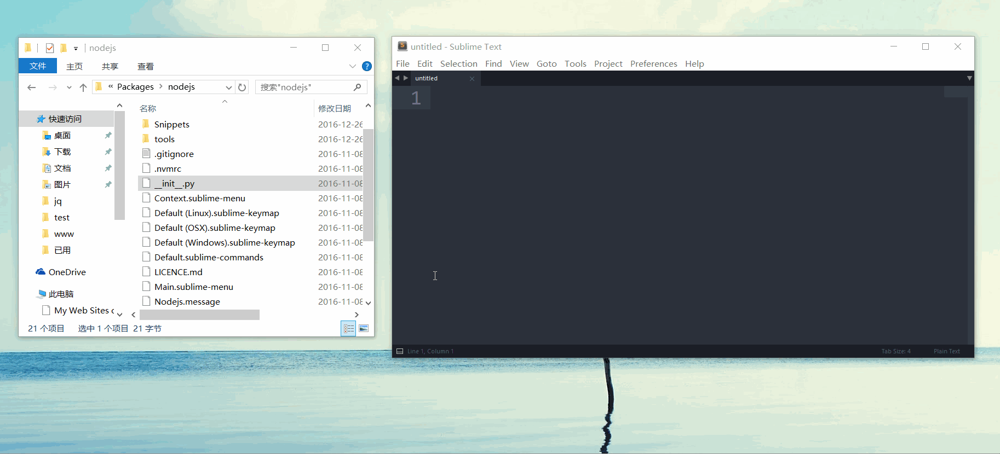

# windows环境下sublime的nodejs插件详细安装图解

## 下载并设置nodejs插件

下载地址为https://github.com/tanepiper/SublimeText-Nodejs

- 下载zip压缩包后解压，文件名改为Nodejs

- 打开Sublime Text3，点击菜单“Perferences” =>“Browse Packages”打开“Packages”文件夹，并将上一步的Nodejs文件夹剪切进来

## 配置参数

- 1、打开文件“Nodejs.sublime-build”，将代码 "encoding": "cp1252" 改为 "encoding": "utf8"，将代码 "cmd": ["taskkill /F /IM node.exe & node", "$file"]改为"cmd": ["node", "$file"]，保存文件

- 2、先找到nodejs安装路径，我电脑nodejs的安装路径为"d:\nodejs"。然后打开文件“Nodejs.sublime-settings”，将代码"node_command": false改为 "node_command": "D:\nodejs\node.exe"，将代码"npm_command": false改为"npm_command": "D:\nodejs\npm.cmd"，保存文件
 
