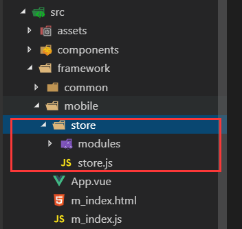

# Vue中Vuex的详解与使用

Vuex 是一个专为 Vue.js 应用程序开发的`状态管理模式`。它采用集中式存储管理应用的所有组件的状态，并以相应的规则保证状态以一种可预测的方式发生变化。

例如：你有几个数据，几个操作，在多个组件上都需要使用，如果每个组件都去调用都是写，就会很麻烦，代码又臭又长。当然 如果没有大量的操作和数据需要在多个组件内使用的话呢，其实也就可以不用这个 Vuex了。看个人吧！

这里我就用自己对 Vuex 的理解来介绍这个东西怎么去使用。

1、首先为了项目格式便于维护和相对规范一点，我们先在 目录下建立一个 store 文件夹，并且在下面建立一个 store.js 文件：


2、简单明了，先引入 Vue 和 Vuex 并且别忘了 Vue.use(Vuex);

```js
// store.js
import Vue from 'vue'
import Vuex from 'vuex'
Vue.use(Vuex)
```

当然你 Vuex 首先得跟 main.js 扯上点关系嘛。这里的 main.js 因为项目原因，暂时换了个名字，不过也无影响，好了我们继续。

=》引入 store 文件  =》   并且 Vue 实例上得将 挂载 store ，这下万无一失。可以继续了

```js
//main.js
import Vue from 'vue'
import App from './App'
import router from './index'
import store from './store'
```
